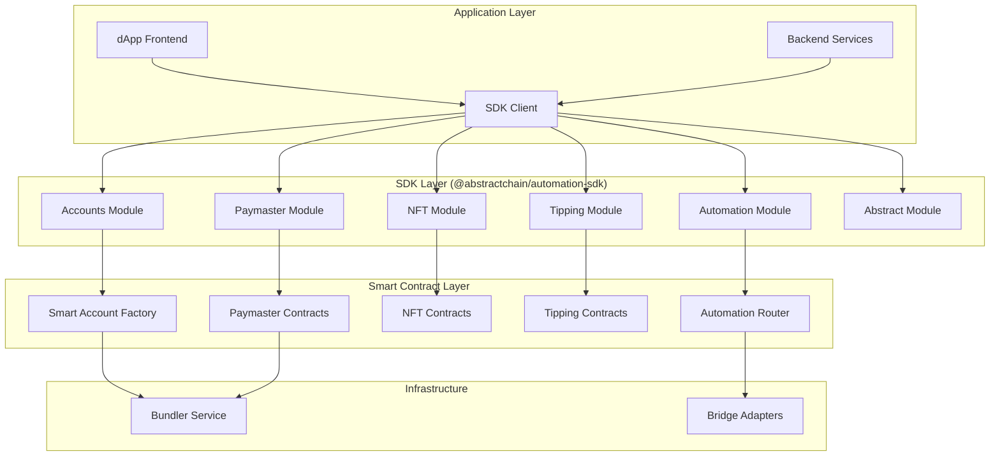

# AbstractChain Automation SDK

[](https://github.com/abstractchain/automation-sdk/actions/workflows/ci.yml)
[](https://codecov.io/gh/abstractchain/automation-sdk)
[](https://badge.fury.io/js/%40abstractchain%2Fsdk)
[](https://opensource.org/licenses/MIT)

A comprehensive open-source TypeScript/Solidity toolkit that leverages **ERC-4337 Account Abstraction** to enable gasless transactions, cross-chain DeFi automation, and social finance features on AbstractChain.

## 🚀 Features

- **🔐 Smart Accounts**: ERC-4337 compatible accounts with custom validation logic
- **⛽ Gas Sponsorship**: Flexible paymaster contracts for gasless transactions
- **🎨 Gasless NFT Minting**: Voucher-based minting with EIP-712 signatures
- **💝 SocialFi Tipping**: Anti-spam protected tipping system
- **🌉 Cross-Chain Automation**: Multi-chain DeFi automation with bridge adapters
- **🔧 Modular SDK**: Tree-shakable TypeScript modules
- **⚡ AbstractChain Native**: Automation pipelines, abstraction nodes, event streams

## 📦 Packages

| Package | Description | Version |
|---------|-------------|---------|
| [`@abstractchain/sdk`](./packages/sdk) | Main TypeScript SDK | [](https://www.npmjs.com/package/@abstractchain/sdk) |
| [`@abstractchain/contracts`](./contracts) | Smart contracts | [](https://www.npmjs.com/package/@abstractchain/contracts) |
| [`@abstractchain/bundler`](./bundler) | ERC-4337 Bundler service | [](https://www.npmjs.com/package/@abstractchain/bundler) |

## 🏗️ Architecture



## 🚀 Quick Start

### Installation

```bash
npm install @abstractchain/sdk
# or
yarn add @abstractchain/sdk
# or
pnpm add @abstractchain/sdk
```

### Basic Usage

```typescript
import { AbstractChainSDK } from '@abstractchain/sdk';

// Initialize SDK
const sdk = new AbstractChainSDK({
  network: 'abstractchain-testnet',
  rpcUrl: 'https://rpc.abstractchain.com',
  bundlerUrl: 'https://bundler.abstractchain.com',
  contracts: {
    entryPoint: '0x...',
    accountFactory: '0x...',
    paymaster: '0x...',
  },
});

// Create a smart account
const account = await sdk.accounts.createAccount('0x...');

// Gasless NFT minting
const voucher = await sdk.nft.createMintVoucher({
  to: '0x...',
  tokenId: 1n,
  uri: 'ipfs://...',
  price: 0n,
  expiry: Date.now() + 3600000, // 1 hour
});

await sdk.nft.mintWithVoucher(voucher);

// SocialFi tipping
await sdk.tipping.tip({
  to: '0x...',
  token: '0x...',
  amount: 1000000n, // 1 USDC
  contentId: 'post-123',
});

// Cross-chain automation
const task = await sdk.automation.createTask({
  name: 'DeFi Yield Farming',
  triggers: [{
    type: 'price',
    condition: 'ETH > 2000',
  }],
  actions: [{
    chainId: 1,
    target: '0x...',
    callData: '0x...',
  }],
});
```

### Modular Imports (Tree-shaking)

```typescript
// Import only what you need
import { AccountsModule } from '@abstractchain/sdk/accounts';
import { PaymasterModule } from '@abstractchain/sdk/paymaster';
import { NFTModule } from '@abstractchain/sdk/nft';
```

## 📚 Documentation

- [**Getting Started**](./docs/getting-started.md) - Setup and basic usage
- [**Smart Accounts**](./docs/accounts.md) - ERC-4337 account management
- [**Gas Sponsorship**](./docs/paymaster.md) - Paymaster integration
- [**NFT Minting**](./docs/nft.md) - Gasless NFT minting with vouchers
- [**SocialFi Tipping**](./docs/tipping.md) - Anti-spam tipping system
- [**Cross-Chain Automation**](./docs/automation.md) - Multi-chain workflows
- [**AbstractChain Features**](./docs/abstract.md) - Native platform integration
- [**API Reference**](./docs/api/) - Complete API documentation

## 🛠️ Development

### Prerequisites

- Node.js 18+
- npm 9+
- [Foundry](https://getfoundry.sh/) for smart contracts

### Setup

```bash
# Clone the repository
git clone https://github.com/abstractchain/automation-sdk.git
cd automation-sdk

# Install dependencies
npm install

# Install contract dependencies
cd contracts && forge install && cd ..

# Build all packages
npm run build

# Run tests
npm test
```

### Project Structure

```
automation-sdk/
├── packages/
│   └── sdk/                 # TypeScript SDK
├── contracts/               # Smart contracts (Foundry)
├── bundler/                # ERC-4337 Bundler service
├── examples/               # Example applications
├── docs/                   # Documentation
└── .github/                # CI/CD workflows
```

### Available Scripts

```bash
# Development
npm run dev                 # Start development mode
npm run build              # Build all packages
npm run test               # Run all tests
npm run lint               # Lint code
npm run format             # Format code

# Contracts
npm run contracts:build    # Build smart contracts
npm run contracts:test     # Test smart contracts
npm run contracts:deploy   # Deploy contracts

# Bundler
npm run bundler:dev        # Start bundler in dev mode
npm run bundler:build      # Build bundler service

# Documentation
npm run docs:build         # Build documentation
npm run docs:serve         # Serve documentation locally
```

## 🧪 Examples

Check out the [examples](./examples/) directory for complete sample applications:

- [**Gasless NFT Marketplace**](./examples/nft-marketplace/) - Complete NFT marketplace with gasless minting
- [**SocialFi Platform**](./examples/socialfi-app/) - Social platform with tipping and reputation
- [**DeFi Automation Bot**](./examples/defi-automation/) - Cross-chain yield farming automation
- [**CLI Tools**](./examples/cli/) - Command-line tools for SDK interaction

## 🔒 Security

This project follows security best practices:

- **Smart Contract Audits**: All contracts undergo thorough security audits
- **Static Analysis**: Automated security scanning with Slither and Mythril
- **Test Coverage**: >98% test coverage requirement
- **Formal Verification**: Critical functions are formally verified

### Reporting Security Issues

Please report security vulnerabilities to [security@abstractchain.com](mailto:security@abstractchain.com).

## 🤝 Contributing

We welcome contributions! Please see our [Contributing Guide](./CONTRIBUTING.md) for details.

### Development Workflow

1. Fork the repository
2. Create a feature branch: `git checkout -b feature/amazing-feature`
3. Make your changes and add tests
4. Ensure all tests pass: `npm test`
5. Commit your changes: `git commit -m 'feat: add amazing feature'`
6. Push to the branch: `git push origin feature/amazing-feature`
7. Open a Pull Request

## 📄 License

This project is licensed under the MIT License - see the [LICENSE](./LICENSE) file for details.

## 🌟 Acknowledgments

- [ERC-4337](https://eips.ethereum.org/EIPS/eip-4337) - Account Abstraction standard
- [OpenZeppelin](https://openzeppelin.com/) - Smart contract security standards
- [Foundry](https://getfoundry.sh/) - Smart contract development framework
- [AbstractChain](https://abstractchain.com/) - Next-generation blockchain platform

## 📞 Support

- **Documentation**: [docs.abstractchain.com](https://docs.abstractchain.com)
- **Discord**: [discord.gg/abstractchain](https://discord.gg/abstractchain)
- **Twitter**: [@AbstractChain](https://twitter.com/AbstractChain)
- **Email**: [support@abstractchain.com](mailto:support@abstractchain.com)

---

Built with ❤️ by the AbstractChain team